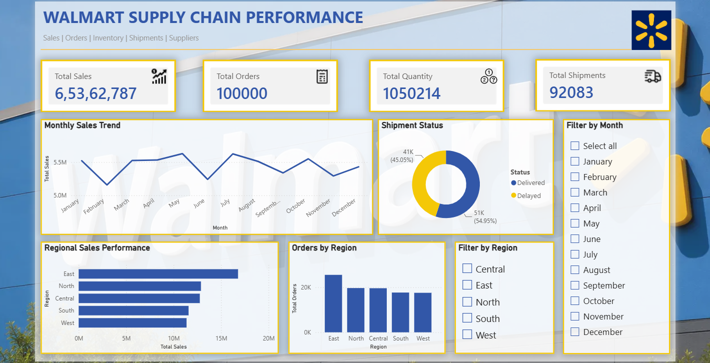
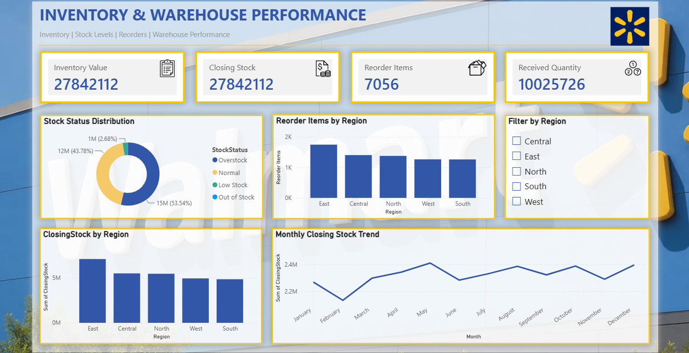
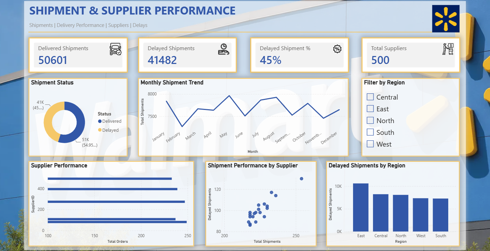

# Walmart Supply Chain Analytics

### SQL & Power BI Industry Project

## 📌 Project Title

**Walmart Supply Chain Analytics — Supply Chain & Logistics**

---

## 🏭 Industry

**Retail | Supply Chain & Logistics | Business Intelligence**

---

## 📌 Project Overview

Walmart Supply Chain Analytics is an end-to-end data analytics project focused on analyzing supply chain operations, sales, orders, inventory, shipments, stores, warehouses, and supplier performance.

The project uses **MySQL and SQL** for database management and data validation, and **Power BI with Power Query and DAX** for data preparation, modeling, KPI development, visualization, and interactive dashboard development.

The final solution consists of a **3-page interactive Power BI dashboard** designed to provide a centralized view of supply chain performance.

---

## 🎯 Project Objectives

* Analyze overall supply chain performance
* Monitor sales and order activity
* Analyze inventory and stock levels
* Identify reorder requirements
* Track delivered and delayed shipments
* Compare regional performance
* Analyze supplier performance
* Build an interactive Power BI dashboard
* Support data-driven operational decisions

---

## 🛠️ Tools & Technologies

| Tool            | Purpose                                 |
| --------------- | --------------------------------------- |
| **MySQL**       | Database creation and data management   |
| **SQL**         | Data validation and analysis            |
| **Power Query** | Data preparation and transformation     |
| **Power BI**    | Dashboard development and visualization |
| **DAX**         | KPI and analytical calculations         |
| **GitHub**      | Project documentation and portfolio     |

---

## 📊 Dataset Description

The project uses a Walmart supply chain dataset organized into **7 relational tables**:

* Inventory
* Orders
* Products
* Shipments
* Stores
* Suppliers
* Warehouse

### Main Data Areas

* Sales and orders
* Product information
* Inventory levels
* Stock quantities
* Shipment status
* Store information
* Supplier information
* Warehouse information

### Inventory Fields

Key inventory fields include:

* ClosingStock
* InvetDate
* InvetID
* InvetValue
* OpeningStock
* ProductID
* RecievedQty
* ReorderLevel
* SoldQty
* StockStatus
* StoreID
* WarehouseID

---

## 🗄️ SQL Analysis

The Walmart supply chain database was created and managed using MySQL.

### Database

```sql
WALMART_SUPPLY_CHAINDB
```

### Tables

```text
inventory
orders
products
shipments
stores
suppliers
warehouse
```

### SQL Activities

* Database creation
* Table management
* Data inspection
* Data validation
* Data type checking
* ID validation
* Inventory data checking
* Database backup/export

---

## 📊 Power BI Dashboard

The Power BI report contains **3 analytical pages**.

### Page 1 — Supply Chain Overview

Analyzes:

* Total Sales
* Total Orders
* Delivered Shipments
* Delayed Shipments
* Monthly trends
* Regional performance

### Page 2 — Inventory & Warehouse Performance

Analyzes:

* Inventory Value
* Closing Stock
* Reorder Items
* Stock Status
* Regional inventory
* Monthly stock trends

### Page 3 — Shipment & Supplier Performance

Analyzes:

* Delivered Shipments
* Delayed Shipments
* Delayed Shipment %
* Total Suppliers
* Shipment trends
* Regional delays
* Top 20 Supplier Performance

### Interactive Features

* Region slicer
* Synchronized filtering across pages
* KPI cards
* Interactive charts
* Regional comparisons
* Top 20 supplier filtering
* Walmart-inspired dashboard theme

---

## 📈 Key KPIs

The dashboard includes the following important KPIs:

* **Total Sales**
* **Total Orders**
* **Total Quantity**
* **Average Order Value**
* **Delivered Shipments**
* **Delayed Shipments**
* **Delayed Shipment %**
* **Total Suppliers**
* **Inventory Value**
* **Closing Stock**
* **Received Quantity**
* **Reorder Items**

---

## 💡 Key Insights

The dashboard helps identify:

* Overall sales and order trends
* Delivered vs delayed shipment patterns
* Regional shipment performance
* Regional inventory requirements
* Stock and reorder conditions
* Supplier shipment performance
* High-volume supplier activity
* Areas requiring operational attention

The analysis demonstrates how supply-chain dashboards can bring together inventory, shipment, supplier, and operational metrics for better decision-making. Supply-chain analytics commonly uses dashboards and SQL/BI tools to monitor inventory and logistics performance. ([Walmart Careers][1])

---

## 🔄 Project Workflow

```text
Data Collection
      ↓
MySQL Database
      ↓
SQL Data Management
      ↓
Data Validation & Preparation
      ↓
Power BI Connection
      ↓
Power Query
      ↓
Data Modeling
      ↓
DAX Measures
      ↓
Dashboard Development
      ↓
Interactive Filtering
      ↓
Business Insights
```

---

## 📁 Repository Structure

```text
walmart-supply-chain-analytics/
│
├── Dataset/
│
├── SQL/
│   └── WALMART_SUPPLY_CHAINDB.sql
│
├── PowerBI/
│   └── Walmart_Supply_Chain_Dashboard.pbix
│
├── Screenshots/
│   ├── Page_1_Supply_Chain_Overview.png
│   ├── Page_2_Inventory_Warehouse.png
│   └── Page_3_Shipment_Supplier.png
│
├── Documentation/
│   └── Walmart_Supply_Chain_Presentation.pptx
│
└── README.md
```

---

## 🖼️ Dashboard Screenshots

### Page 1 — Supply Chain Overview



### Page 2 — Inventory & Warehouse Performance



### Page 3 — Shipment & Supplier Performance



---

## 🚀 How to Run the Project

### Step 1 — Database

Install **MySQL** and create/import the database:

```text
WALMART_SUPPLY_CHAINDB
```

### Step 2 — SQL

Open the SQL file and execute the required database/table scripts.

### Step 3 — Power BI

Open:

```text
Walmart_Supply_Chain_Dashboard.pbix
```

### Step 4 — Connect Database

If required, update the MySQL connection details in Power BI.

### Step 5 — Refresh Data

Click:

**Home → Refresh**

### Step 6 — Explore Dashboard

Navigate through the 3 dashboard pages and use the **Region slicer** to interact with the analysis.


## 👩‍💻 Author

### Divya Varshini R.

**ID:** AF05264781

**Education:** B.Tech Computer Science & Engineering

**Project:** Walmart Supply Chain Analytics

**Industry:** Retail | Supply Chain & Logistics

**Technologies:** MySQL | SQL | Power BI | Power Query | DAX | GitHub

**Project Focus:** Data Analytics | Business Intelligence | Supply Chain Analytics | Inventory Analysis | Shipment Analysis | Supplier Performance

---

## ⭐ Skills Demonstrated

**SQL | MySQL | Data Validation | Data Preparation | Power Query | Data Modeling | DAX | Power BI | Data Visualization | KPI Development | Business Analysis | Dashboard Development**
